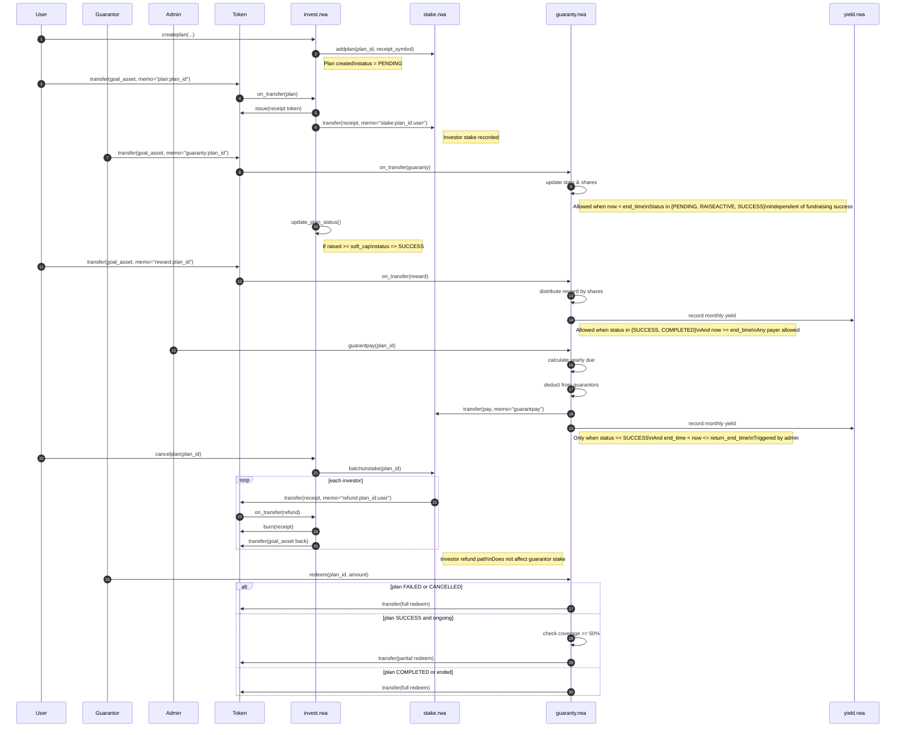

# RWA 四模块对接文档

---

## A. invest.rwa（募资计划管理）

模块作用
负责募资计划的创建、状态流转、投资入口控制，是整个 RWA 生命周期的起点。

---

### A.1 addtoken

调用者: admin / self

参数:
| 名称 | 类型 | 说明 |
|---|---|---|
| sym | symbol | 允许募资的币种 |

---

### A.2 deltoken

调用者: admin / self

参数:
| 名称 | 类型 | 说明 |
|---|---|---|
| sym | symbol | 要移除的募资币种 |

---

### A.3 createplan

调用者: 任意用户（募资发起人）

参数:
| 名称 | 类型 | 说明 |
|---|---|---|
| goal_asset_contract | name | 募资 token 合约 |
| goal_quantity | asset | 募资目标金额 |
| receipt_asset_contract | name | 投资凭证合约 |
| receipt_symbol | symbol | 投资凭证 symbol |
| soft_cap_percent | uint8 | 软顶比例(%) |
| hard_cap_percent | uint8 | 硬顶比例(%) |
| start_time | time_point_sec | 募资开始时间 |
| end_time | time_point_sec | 募资结束时间 |
| return_months | uint16 | 回报周期(月) |

---

### A.4 cancelplan

调用者: 计划创建者

参数:
| 名称 | 类型 | 说明 |
|---|---|---|
| plan_id | uint64 | 募资计划 ID |

说明:
- 仅在 `now < end_time` 时允许取消
- 取消后会通知 `stake.rwa::batchunstake` 执行退款

---

### A.5 on_transfer（投资 / 退款入口）

触发合约: 募资 token 合约 `transfer`

参数:
| 名称 | 类型 | 说明 |
|---|---|---|
| from | name | 转出账户 |
| to | name | invest.rwa |
| quantity | asset | 金额 |
| memo | string | 指令 |

memo:
- `plan:<plan_id>`
- `refund:<plan_id>:<investor>`

---

## B. stake.rwa（投资凭证管理 + 投资退款）

模块作用
管理投资人凭证余额、分红累计，以及失败/取消计划的批量退款。

---

### B.1 addplan

调用者: invest.rwa

参数:
| 名称 | 类型 | 说明 |
|---|---|---|
| plan_id | uint64 | 募资计划 ID |
| receipt_symbol | symbol | 投资凭证 symbol |

---

### B.2 on_transfer（凭证流转）

触发合约: 凭证 token 合约 `transfer`

参数:
| 名称 | 类型 | 说明 |
|---|---|---|
| from | name | 转出账户 |
| to | name | stake.rwa |
| quantity | asset | 凭证数量 |
| memo | string | 指令 |

memo:
- `stake:<plan_id>:<investor>`（投资凭证入池）
- `reward:<plan_id>`（投资收益充值）

---

### B.3 batchunstake

调用者: INVEST_POOL

参数:
| 名称 | 类型 | 说明 |
|---|---|---|
| plan_id | uint64 | 募资计划 ID |

说明:
- 仅用于 `FAILED / CANCELLED` 计划
- 遍历所有 staker，返还可退款金额

---

### B.4 delplan

调用者: admin

参数:
| 名称 | 类型 | 说明 |
|---|---|---|
| plan_id | uint64 | 募资计划 ID |

前置条件:
- 无 staker
- 奖励已完全领取

---

## C. guaranty.rwa（担保池 + 担保补贴 + 担保人赎回）

模块作用
处理担保本金、担保分红、年度兜底补贴，以及担保人赎回。

---

### C.1 on_transfer（担保 / 分红）

触发合约: 募资 token 合约 `transfer`

参数:
| 名称 | 类型 | 说明 |
|---|---|---|
| from | name | 转出账户 |
| to | name | guaranty.rwa |
| quantity | asset | 金额 |
| memo | string | 指令 |

memo:
- `guaranty:<plan_id>`（担保本金）
- `reward:<plan_id>`（担保分红）

---

### C.2 guarantpay

调用者: admin

参数:
| 名称 | 类型 | 说明 |
|---|---|---|
| plan_id | uint64 | 募资计划 ID |

说明:
- 按自然年检查担保覆盖率
- 不足部分从担保池按占比扣减并补贴给投资人

---

### C.3 redeem

调用者: 担保人

参数:
| 名称 | 类型 | 说明 |
|---|---|---|
| plan_id | uint64 | 募资计划 ID |
| quantity | asset | 赎回金额 |

赎回逻辑（自动判断）:
1. FAILED / CANCELLED：全部可赎回
2. SUCCESS 且未到期：coverage ≥ 50% 才允许部分赎回
3. 项目到期：全部可赎回

---

## D. yield.rwa（投资收益日志）

模块作用
记录每月收益日志，供 stake.rwa / guaranty.rwa 读取。

---

### D.1 logyield（内部）

调用者: 系统内部

参数:
| 名称 | 类型 | 说明 |
|---|---|---|
| plan_id | uint64 | 募资计划 ID |
| quantity | asset | 收益金额 |

## RWA 全生命周期时序图

### 参与方说明

- **User**：投资人 / 募资发起人
- **Guarantor**：担保人
- **Admin**：系统管理员
- **invest.rwa**：募资计划与资金入口
- **stake.rwa**：投资凭证 & 投资人余额
- **guaranty.rwa**：担保资金池 & 兜底逻辑
- **yield.rwa**：收益日志
- **Token**：募资资产 / 凭证资产合约

---

## RWA 全生命周期时序图

### 全生命周期时序（Mermaid）

