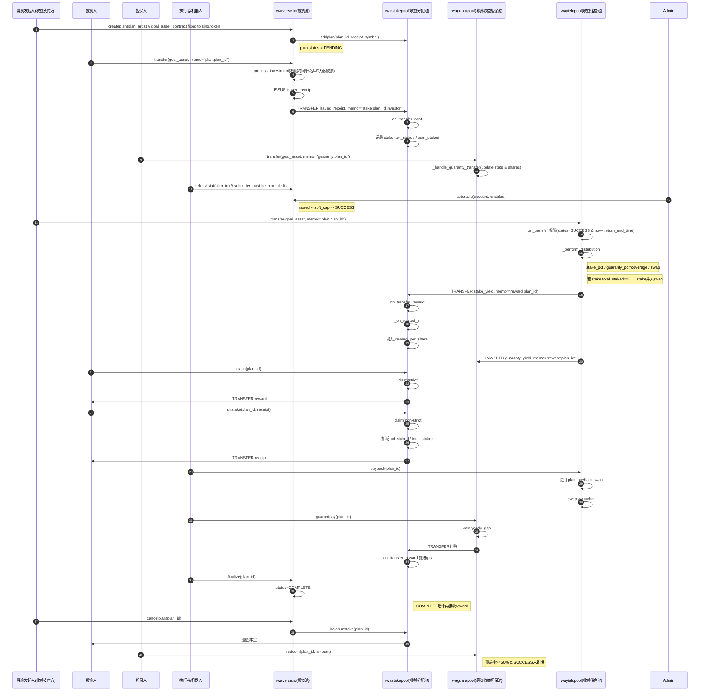

# RWA 四模块对接文档

---

## A. rwaverse.io（募资计划管理）

模块作用
负责募资计划的创建、状态流转、投资入口控制，是整个 RWA 生命周期的起点。

---

### A.1 addtoken

调用者: admin / self

参数:
| 名称 | 类型 | 说明 |
|---|---|---|
| sym | symbol | 允许募资的币种 |

---

### A.2 deltoken

调用者: admin / self

参数:
| 名称 | 类型 | 说明 |
|---|---|---|
| sym | symbol | 要移除的募资币种 |

---

### A.3 createplan

调用者: 任意用户（募资发起人）

参数:
| 名称 | 类型 | 说明 |
|---|---|---|
| goal_asset_contract | name | 募资 token 合约（固定为 sing.token） |
| goal_quantity | asset | 募资目标金额 |
| receipt_asset_contract | name | 投资凭证合约 |
| receipt_symbol | symbol | 投资凭证 symbol |
| soft_cap_percent | uint8 | 软顶比例(%) |
| hard_cap_percent | uint8 | 硬顶比例(%) |
| start_time | time_point_sec | 募资开始时间 |
| end_time | time_point_sec | 募资结束时间 |
| return_months | uint16 | 回报周期(月) |

---

### A.4 cancelplan

调用者: 计划创建者

参数:
| 名称 | 类型 | 说明 |
|---|---|---|
| plan_id | uint64 | 募资计划 ID |

说明:
- 仅在 `now < end_time` 时允许取消
- 取消后会通知 `rwastakepool::batchunstake` 执行退款

---

### A.5 on_transfer（投资 / 退款入口）

触发合约: 募资 token 合约 `transfer`

参数:
| 名称 | 类型 | 说明 |
|---|---|---|
| from | name | 转出账户 |
| to | name | rwaverse.io |
| quantity | asset | 金额 |
| memo | string | 指令 |

memo:
- `plan:<plan_id>`
- `refund:<plan_id>:<investor>`

---

## B. rwastakepool（投资凭证管理 + 投资退款）

模块作用
管理投资人凭证余额、分红累计，以及失败/取消计划的批量退款。

---

### B.1 addplan

调用者: rwaverse.io

参数:
| 名称 | 类型 | 说明 |
|---|---|---|
| plan_id | uint64 | 募资计划 ID |
| receipt_symbol | symbol | 投资凭证 symbol |

---

### B.2 on_transfer（凭证流转）

触发合约: 凭证 token 合约 `transfer`

参数:
| 名称 | 类型 | 说明 |
|---|---|---|
| from | name | 转出账户 |
| to | name | rwastakepool |
| quantity | asset | 凭证数量 |
| memo | string | 指令 |

memo:
- `stake:<plan_id>:<investor>`（投资凭证入池）
- `reward:<plan_id>`（投资收益充值）

---

### B.3 batchunstake

调用者: INVEST_POOL

参数:
| 名称 | 类型 | 说明 |
|---|---|---|
| plan_id | uint64 | 募资计划 ID |

说明:
- 仅用于 `FAILED / CANCELLED` 计划
- 遍历所有 staker，返还可退款金额

---

### B.4 delplan

调用者: admin

参数:
| 名称 | 类型 | 说明 |
|---|---|---|
| plan_id | uint64 | 募资计划 ID |

前置条件:
- 无 staker
- 奖励已完全领取

---

## C. rwaguarapool（担保池 + 担保补贴 + 担保人赎回）

模块作用
处理担保本金、担保分红、年度兜底补贴，以及担保人赎回。

---

### C.1 on_transfer（担保 / 分红）

触发合约: 募资 token 合约 `transfer`

参数:
| 名称 | 类型 | 说明 |
|---|---|---|
| from | name | 转出账户 |
| to | name | rwaguarapool |
| quantity | asset | 金额 |
| memo | string | 指令 |

memo:
- `guaranty:<plan_id>`（担保本金）
- `reward:<plan_id>`（担保分红）

---

### C.2 guarantpay

调用者: admin

参数:
| 名称 | 类型 | 说明 |
|---|---|---|
| plan_id | uint64 | 募资计划 ID |

说明:
- 按自然年检查担保覆盖率
- 不足部分从担保池按占比扣减并补贴给投资人

---

### C.3 redeem

调用者: 担保人

参数:
| 名称 | 类型 | 说明 |
|---|---|---|
| plan_id | uint64 | 募资计划 ID |
| quantity | asset | 赎回金额 |

赎回逻辑（自动判断）:
1. FAILED / CANCELLED：全部可赎回
2. SUCCESS 且未到期：coverage ≥ 50% 才允许部分赎回
3. 项目到期：全部可赎回

---

## D. `rwayieldpool`（收益储备池 & 分配引擎）

### 模块作用

`rwayieldpool` 是 **RWA 收益的统一入口与分配中枢**，职责包括：

- 接收 **募资发起人 / 业务侧** 打入的收益资金
- 按配置规则将收益拆分为：
  - 投资人收益（→ `rwastakepool`）
  - 担保人收益（→ `rwaguarapool`）
  - 回购资金（→ AMM / buyback 池）
- 记录 **按月的收益日志**
- 提供 **年度收益查询**
- 管理 **回购余额与执行**

> 重要定位
> - `rwayieldpool` 不持有投资人凭证
> - `rwayieldpool` 不直接给投资人/担保人转账
> - 所有收益分发都通过 stake / guaranty 合约完成

---

### D.1 `on_transfer`（收益入账 & 自动分配）

**调用者**：募资发起人 / 业务系统 / 收益储备账户（通过 `sing.token::transfer` 触发）

**memo 格式**

`plan:<plan_id>`

**参数**

| 名称 | 类型 | 说明 |
|---|---|---|
| from | name | 收益支付方（募资人/业务收入账户） |
| to | name | `rwayieldpool` |
| quantity | asset | 本次收益金额 |
| memo | string | `plan:<plan_id>` |

**核心校验逻辑**

- 募资计划必须存在
- 计划状态必须为 `SUCCESS`
- 当前时间 `< return_end_time`
- 收益币种必须等于募资币种

**行为说明**

- 立即调用 `_perform_distribution`
- 同步完成收益拆分与转账

---

### D.2 `_perform_distribution`（内部 · 收益拆分执行）

**调用者**：`on_transfer`

**拆分规则**

根据全局配置 `yield_split_conf`，并结合担保覆盖率：

| 去向 | 说明 |
|---|---|
| `rwastakepool` | 投资人收益 |
| `rwaguarapool` | 担保人收益（× 覆盖率） |
| buyback 池 | 回购资金 |

> 担保人收益比例 = `guaranty_pct × coverage_ratio`

**实际转账**

| 目标合约 | memo |
|---|---|
| `rwastakepool` | `reward:<plan_id>` |
| `rwaguarapool` | `reward:<plan_id>` |
| 回购池 | 记录为 buyback 余额，不立即 swap |

---

### D.3 `logyield`（内部 · 月度收益日志）

**调用者**：系统内部（`_perform_distribution`）

**参数**

| 名称 | 类型 | 说明 |
|---|---|---|
| plan_id | uint64 | 募资计划 ID |
| total | asset | 本期总收益 |
| investor | asset | 投资人收益 |
| guarantor | asset | 担保人收益 |
| buyback | asset | 回购资金 |

**日志内容（按月 `YYYYMM`）**

- period_yield（当月总收益）
- investor_yield
- guarantor_yield
- buyback_yield
- cumulative_yield（累计收益）

---

### D.4 `get_yearly_yield`（查询 · 年度收益）

**调用者**：任何合约 / 前端 / 查询方

**参数**

| 名称 | 类型 | 说明 |
|---|---|---|
| plan_id | uint64 | 募资计划 ID |
| year | uint64 | 年份（如 2025） |
| type | string | `total / investor / guarantor / buyback` |

**返回**

| 类型 | 说明 |
|---|---|
| asset | 对应类型的年度累计收益 |

---

### D.5 `buyback`（回购执行）

**调用者**：任何人（无需 admin）

**参数**

| 名称 | 类型 | 说明 |
|---|---|---|
| submitter | name | 触发人 |
| plan_id | uint64 | 募资计划 ID |

**行为说明**

- 使用 `plan_buyback` 表中累计的回购余额
- 通过 AMM 执行 swap（如 `SING → GNIS`）
- 不影响投资人 / 担保人收益，只影响回购仓位

---

### D.6 `setslippage`（配置 · 回购滑点）

**调用者**：管理员

**参数**

| 名称 | 类型 | 说明 |
|---|---|---|
| submitter | name | 管理员 |
| plan_id | uint64 | 募资计划 ID |
| max_slippage | uint16 | 最大滑点（bps） |

## RWA 全生命周期时序图

### 参与方说明

- **Sponsor**：募资发起人
- **Investor**：投资人
- **Guarantor**：担保人
- **Admin**：系统管理员
- **rwaverse.io**：募资计划与资金入口
- **rwastakepool**：投资凭证 & 投资人余额
- **rwaguarapool**：担保资金池 & 兜底逻辑
- **rwayieldpool**：收益日志

---

## RWA 全生命周期时序图

### 全生命周期时序（Mermaid）

